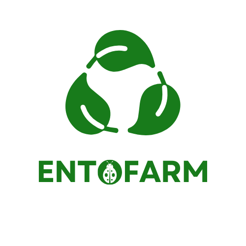

# EntoFARM

**Promoting Circular Economy Strategies through Open Source Insect Farm Technology among School Children**

Erasmus+ KA210-SCH (Small-scale partnerships in school education) · Project no. `2024-2-EL01-KA210-SCH-000285053` · Website: <https://ento.farm>

---

## 1. What is EntoFARM?

EntoFARM is an Erasmus+ project that brings **circular economy** and **sustainable agriculture** into secondary-school classrooms through a hands-on tool: a low-cost, small-scale **insect farm (an "EntoFARM")**.

Students rear yellow mealworms (*Tenebrio molitor*) on wheat bran and vegetable waste. The larvae turn food waste into a resource, and their droppings (**frass**) can be collected and used as organic fertiliser. In this way students see a circular economy in action: waste in, resource out.

The project is open source. All guides and teaching materials are free to use, adapt and translate, so that any school, especially schools with limited resources, can build a farm and teach with it.

## 2. Why?

- Show real-world applications of the circular economy to young people and build environmental awareness.
- Promote **STEM education**, especially for groups that are under-represented in science, such as **girls** and students from **rural areas**.
- Give teachers ready-to-use, innovative teaching material and digital tools to bring sustainability into their lessons.
- Strengthen cooperation between schools, universities and local communities for long-term impact.

## 3. What was produced?

| Result | What it is | Where |
|---|---|---|
| **EntoFARM Guide: how to build your own insect farm** | A step-by-step manual for a modular, stackable farm for yellow mealworms. It keeps 25–30 °C and 60–70 % humidity with simple heaters and low-cost sensors. Insects are fed with wheat bran and vegetable waste, separated with metal meshes, and frass is collected as fertiliser. Tested in four units: a basic set-up costs about €50 and an advanced one about €100. Based on the entomology expertise of the Universities of Thessaly and Patras. | [`guides/`](guides) |
| **EntoFARM Quick Guide** | A short practical reference to keep next to the classroom farm: materials list, tray assembly, target temperature and humidity, feeding and moisture routines, separating larvae, harvesting frass. | [`guides/`](guides) |
| **Circular Economy Educational Toolkit** | Open-source lesson plans, interactive modules and multimedia content in five modules (see below). Piloted in schools in Greece, Bulgaria and North Macedonia and refined with teacher and student feedback. | [`toolkit/`](toolkit) |
| **Capacity-building videos for teachers** | Five short instructional videos with downloadable handouts, developed from the project's teacher webinars. The webinars trained **135 teachers** across Greece, Bulgaria and North Macedonia (target: 100). Recordings were turned into videos to protect participants' privacy. | [Watch online](https://app.lumi.education/run/n-4zjN) · <https://www.ento.farm/file-share> |
| **Students' documentary** | A youth-led film in which students planned, scripted, filmed and edited the story of their insect farms. Subtitled in English, Greek, Bulgarian and Macedonian; screened at school open days and at European Researchers' Night 2025 in Larissa, and available on YouTube. | <https://www.ento.farm/about-3> |

All guides and toolkit modules exist in **four languages: English (EN), Greek (EL), Bulgarian (BG) and Macedonian (MK)**.

### The five toolkit modules

Each module combines lesson plans, waste-to-resource simulation activities, videos, infographics and assessment tools such as quizzes and project-based tasks.

1. Introduction to Circular Economy
2. Sustainable Agriculture and Resource Management
3. Insect Farming as a Model for Circular Economy
4. Waste-to-Resource Conversion
5. Implementing Circular Economy Practices in Daily Life

## 4. How to use these materials

- **Teachers:** start with the Quick Guide, build a farm with the Guide, then use the toolkit modules in your own language.
- **Students and enthusiasts:** the Guide lists a materials list and costs, so you can build a farm yourself.

## 5. Partners

| Organisation | Role |
|---|---|
| Fraud Line / INNOFY | Coordinator |
| University of Thessaly | Partner |
| University of Patras | Partner |
| Inter-Edu | Partner |
| 1st EPAL of Volos | Partner |
| SPFO | Partner |
| Professional School of Agriculture "Buzema" (Bulgaria) | Partner |

## 6. Funding

Funded by the European Union. Views and opinions expressed are however those of the author(s) only and do not necessarily reflect those of the European Union or the European Education and Culture Executive Agency (EACEA). Neither the European Union nor EACEA can be held responsible for them.
